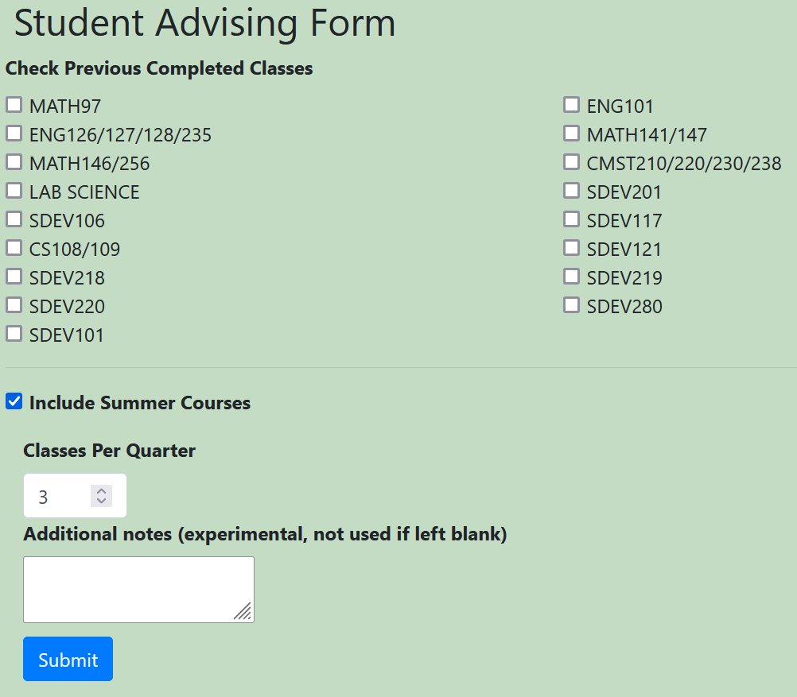
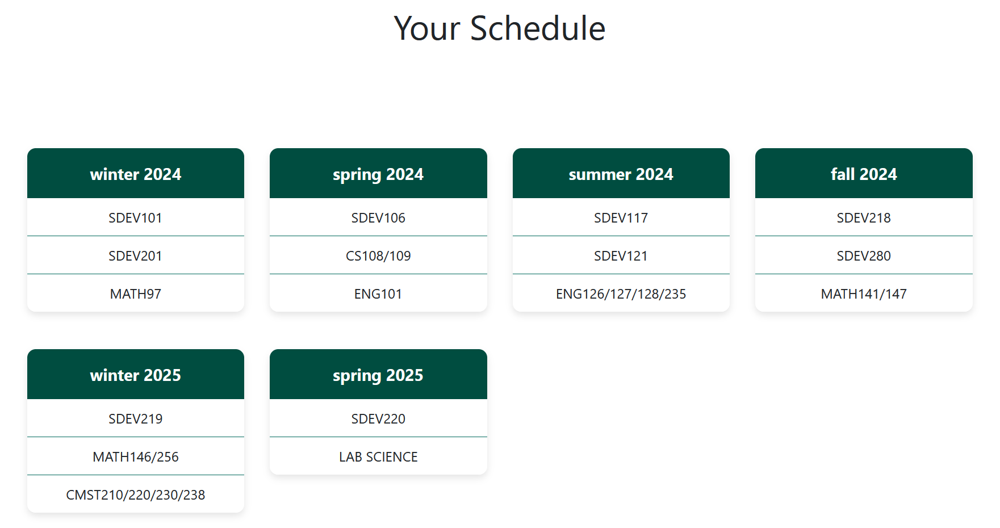
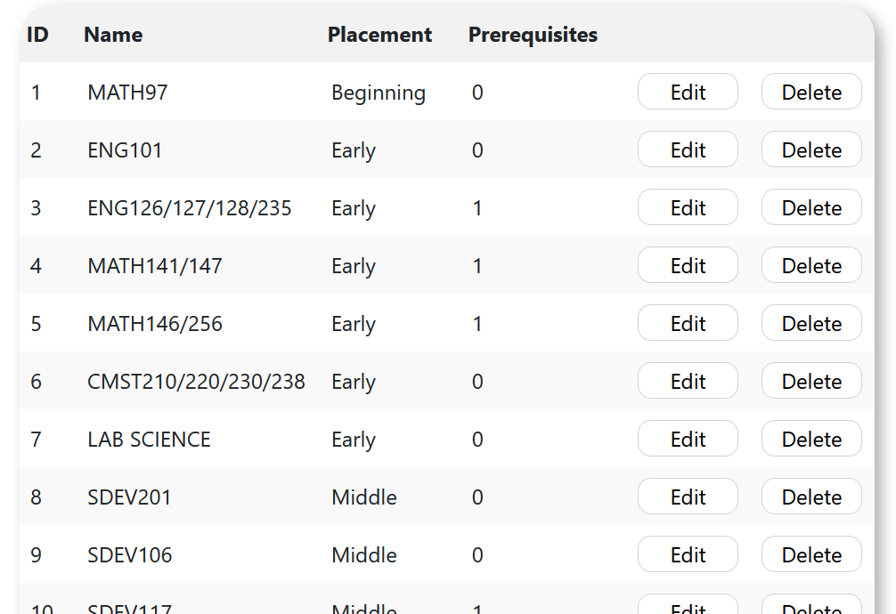
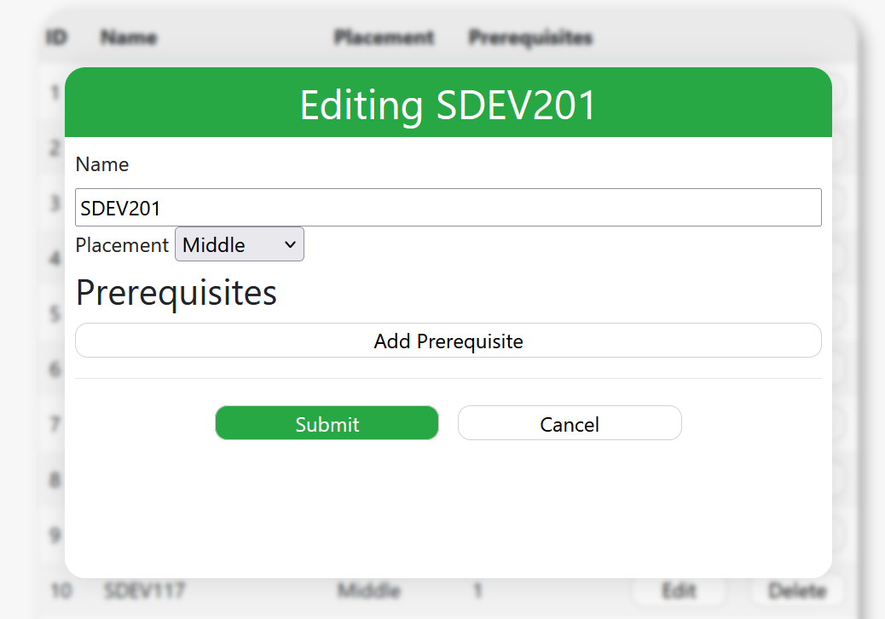

# Advising Tool

## Goal
The goal of this project is to assist advisors in guiding students through the schedule planning process
by considering their academic history and personal preferences.

Users are required to fill out a form detailing information such as class completion history,
interest in summer courses, and desired number of classes per quarter.
Upon gathering this information, the user will receive a customized schedule tailored to their inputs.

## Purpose

We aim to address the common need among advisers by providing a tool to assist them in their tasks of creating
schedules for students, as this work tends to be a repetitive process.

This tool is designed to improve and support the tasks typically undertaken by advisers in their
day-to-day responsibilities.

## Use

### Creating a Schedule
To begin configuring your schedule, navigate to the form page by clicking the 'form' link in the navigation bar.

Once there, fill out all the necessary information in the form and click 'Submit'.

Following submission, you will be directed to a page displaying a configured schedule based on the entries you provided
in the form.

### Editing Course Data
As an administrator,
you have the capability to make adjustments to the course curriculum directly from the admin page of the application.

Here, you can add or remove classes, as well as make edits to existing classes within the program.
Access this functionality by navigating to 'advising-tool/admin'.

## Documentation

Additional documentation may be found in the `documentation` directory,
including [API documentation](documentation/api.md) and [project structure](documentation/files.md).